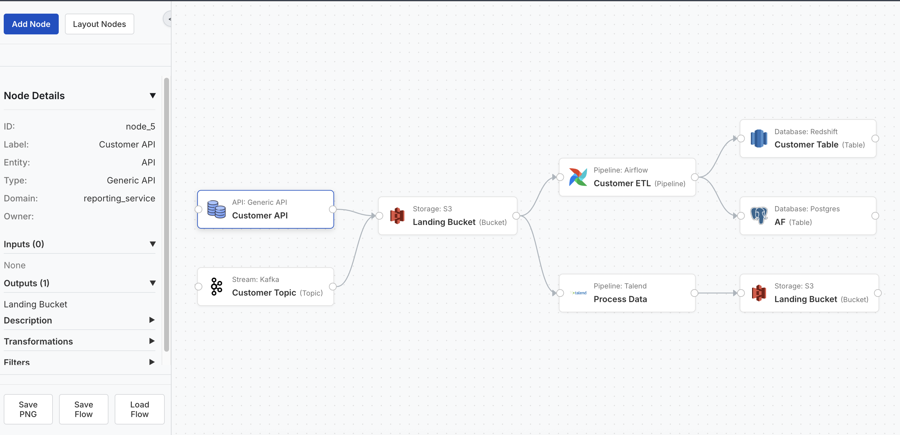

# Data Lineage UI

[View Live Demo on GitHub Pages](https://nick-young.github.io/data-lineage-ui/)

This project provides a user interface for visualizing data lineage using React and ReactFlow.



## Features

*   **Interactive Canvas:** Build and manipulate lineage graphs using drag-and-drop.
*   **Node Management:**
    *   Add new nodes with hierarchical types (Entity, Type, SubType) via the "Add Node" button and form.
    *   Edit existing node details via a modal form (double-click a node).
    *   Delete single or multiple selected nodes.
    *   Copy (Ctrl/Cmd+C) and Paste (Ctrl/Cmd+V) nodes.
*   **Custom Nodes:** Visually distinct nodes showing key information (Label, Entity, Type, SubType).
    *   Icons are dynamically assigned based on the node's Entity and Type (configured in `src/config/nodeTypesConfig.ts`, using icons from `src/assets/`).
*   **Edge Management:**
    *   Connect nodes to represent relationships.
    *   View and edit relationship details by selecting an edge.
*   **Collapsible Sidebar:**
    *   View detailed information about selected nodes or edges.
    *   See connected input and output nodes.
    *   Access control buttons (Add, Layout, Delete, Save, Load).
*   **Automatic Layout:** Arrange nodes automatically in a Left-to-Right flow using the Dagre library ("Layout Nodes" button).
*   **Persistence:** Save the current graph state (nodes, edges, viewport) to a JSON file and load it back.
*   **Export:** Save the current view of the graph as a PNG image.
*   **Styling:** UI elements styled for a clean look, inspired by OpenMetadata.

## Installation & Setup

1.  **Navigate to the UI directory:**
    Assuming you are in the project root:
    ```bash
    cd data-lineage-ui
    ```

2.  **Install dependencies:**
    Requires Node.js and npm.
    ```bash
    npm install
    ```

3.  **Run the development server:**
    ```bash
    npm run dev
    ```

4.  **Open the application:**
    Navigate to `http://localhost:5174` (or the port specified in the terminal output) in your web browser.

## Running with Docker (Alternative)

If you have Docker and Docker Compose (or the integrated `docker compose` command) installed, you can build and run the application in a container:

1.  **Navigate to the UI directory:**
    ```bash
    cd data-lineage-ui
    ```

2.  **Build and run the container:**
    ```bash
    docker compose up -d --build
    ```
    *(Note: Use `docker-compose` with a hyphen if the command above fails)*

3.  **Open the application:**
    Navigate to `http://localhost:5174` in your web browser.

4.  **To stop the container:**
    ```bash
    docker compose down
    ```

## Development Notes

*   Built with React, TypeScript, and Vite.
*   Uses React Flow for the graph visualization and interaction.
*   Uses Dagre for automatic layout.
*   State is primarily managed within the `App.tsx` component using React hooks (`useState`, `useCallback`, `useMemo`, `useEffect`).
*   Node icons are configured in `src/config/nodeTypesConfig.ts` and sourced from `src/assets/`.
*   Initial node/edge data and subsequent changes are persisted to Local Storage.

## Versioning

This project uses [`standard-version`](https://github.com/conventional-changelog/standard-version) for automated version bumping and CHANGELOG generation based on [Conventional Commits](https://www.conventionalcommits.org/).

1.  **Commit Changes:** Make your code changes and commit them using the Conventional Commits format. Examples:
    *   `git commit -m "fix: resolve sidebar layout issue"` (Patches the version)
    *   `git commit -m "feat: add node copy/paste functionality"` (Minor version bump)
    *   `git commit -m "refactor!: change node data structure"` (Major version bump due to BREAKING CHANGE)

2.  **Run Release Script:** When ready to cut a new version, run the following command **from within the `data-lineage-ui` directory**:
    ```bash
    npm run release
    ```
    This command will:
    *   Analyze commits since the last Git tag.
    *   Determine the appropriate version bump (patch, minor, or major).
    *   Update the `version` in `package.json`.
    *   Generate/update a `CHANGELOG.md` file (if not present, may need initial configuration).
    *   Create a new Git commit for the version bump.
    *   Create a Git tag for the new version.

3.  **Push Changes:** Push the commits and the new tag to your remote repository:
    ```bash
    git push --follow-tags origin <your-branch-name>
    ```

## Features Implemented (MVP)

*   **Visual Graph Canvas:** Renders nodes and edges using React Flow.
*   **Node Rendering:** Displays nodes with labels and type information using a custom node component.
*   **Node Selection:** Allows selecting nodes to view their properties in a sidebar.
*   **Node Creation:** Provides an "Add Node" button and a modal form to create new nodes with properties:
    *   Name (Label)
    *   Type (Dropdown: API, Database Table, Airflow Pipeline, Storage (S3), Kafka Topic, External System)
    *   Domain
    *   Owner
    *   Description
    *   Transformations
    *   Filters
*   **Edge Creation:** Allows connecting nodes via drag-and-drop between handles.
*   **Relationship Details:** Allows selecting edges to view source/target information and add/edit free-text details in the sidebar.
*   **Sidebar Display:** Shows details for the currently selected node or edge, including dynamically calculated inputs/outputs for nodes.
*   **Local Storage Persistence:** Saves the graph state (nodes and edges, including edge details) to the browser's local storage, so the graph persists across page refreshes.

## License

This project is licensed under the MIT License - see the [LICENSE](LICENSE) file for details.

## Next Steps / Future Enhancements (From PRD)

*   Backend storage for persistent graphs.
*   User authentication and collaboration features.
*   Ability to import/export lineage data.
*   Search and filtering capabilities.
*   Automatic lineage discovery via integrations (e.g., Airflow, dbt).
*   Version history for graphs.
*   More sophisticated layout algorithms.
*   Node grouping/layering.
*   Visual node icons.
*   UI styling improvements (e.g., align with OpenMetadata theme).
